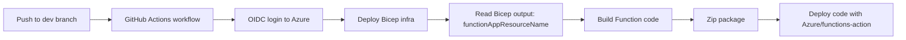

# Invoice Tracker Demo Knowledge Base

## 1. Purpose
This project is a teaching demo for using **Azure Infrastructure + Azure Functions + GitHub OIDC + GitHub Actions CI/CD** as one delivery system.

Use this file as the single source of truth for how the pieces connect.

## 2. Repository Map
- `infra/main.bicep`: Creates Azure resources (Storage, App Service Consumption Plan, User Assigned Managed Identity, Function App).
- `my-func-api/src/functions/hello.ts`: HTTP trigger function (runtime app code).
- `my-func-api/package.json`: Build/start scripts and Node/runtime metadata.
- `my-func-api/tsconfig.json`: TypeScript compiler strictness and output config.
- `.github/workflows/deploy-dev.yml`: CI/CD pipeline that deploys infra first, then function code.

## 3. Architecture and Flow


## 4. Key Design Choices
- Infra and app deployments happen in a single workflow so environments stay consistent.
- Workflow reads the Function App name from Bicep outputs, preventing drift and manual copy/paste mistakes.
- OIDC is used instead of long-lived Azure secrets.
- Function app stays simple (`GET`/`POST`) but includes structured logging and predictable input handling.

## 5. One-Time Setup (Azure + GitHub)

### 5.1 Prerequisites
Install and verify:
```bash
node -v
npm -v
func --version
az --version
```

### 5.2 Create Resource Group
```bash
az group create -n rg-func-dev -l australiaeast
```

### 5.3 Deploy Infrastructure Locally (first run)
```bash
az deployment group create \
  -g rg-func-dev \
  -f infra/main.bicep \
  -p namePrefix=alexdev
```

Useful outputs:
- `functionAppResourceName`
- `storageAccountName`
- `identityClientId`

### 5.4 GitHub OIDC Setup
1. Create an Entra App Registration.
2. Capture:
- Client ID
- Tenant ID
3. Assign role at resource-group scope (Contributor for demo simplicity).
4. Add a federated credential for the GitHub repo and `dev` environment.

### 5.5 GitHub Environment Variables
Create environment `dev` and add:
- `AZURE_CLIENT_ID`
- `AZURE_TENANT_ID`
- `AZURE_SUBSCRIPTION_ID`
- `AZURE_RG` (example: `rg-func-dev`)
- `NAME_PREFIX` (example: `alexdev`)

Note: `FUNCTIONAPP_NAME` is no longer required because workflow reads it from Bicep output.

## 6. Local Development
```bash
cd my-func-api
npm ci
npm run start
```

### 6.1 Test endpoints
GET with query string:
```bash
curl "http://localhost:7071/api/hello?name=Alex"
```

POST plain text body:
```bash
curl -X POST "http://localhost:7071/api/hello" \
  -H "Content-Type: text/plain" \
  -d "Alex"
```

POST JSON body:
```bash
curl -X POST "http://localhost:7071/api/hello" \
  -H "Content-Type: application/json" \
  -d '{"name":"Alex"}'
```

## 7. CI/CD Workflow Behavior
Workflow file: `.github/workflows/deploy-dev.yml`

On every push to `dev`:
1. Checkout repository.
2. Login to Azure using OIDC.
3. Deploy `infra/main.bicep`.
4. Extract `functionAppResourceName` from deployment outputs.
5. Build TypeScript function app.
6. Prune dev dependencies (`npm prune --omit=dev`) before packaging.
7. Create zip artifact (`functionapp.zip`) from deployable files only (`host.json`, `package*.json`, `dist`, `node_modules`).
8. Deploy zip to the resolved Function App.

Packaging intentionally excludes local-only files like `local.settings.json`.

## 8. Important Learning Points
- Identity separation: GitHub OIDC App Registration is used for deployment-time auth; Function App User Assigned Managed Identity is for runtime auth to other Azure services.
- Bicep naming constraints: Storage names must be lowercase/alphanumeric and <=24 chars; the template normalizes and truncates prefixes to stay valid.
- Strict TypeScript: `strict: true` catches common input/type mistakes before deployment.

## 9. Common Issues and Fixes
- OIDC `AADSTS700213` login failure: verify federated credential repo/branch/environment exactly matches workflow trigger and environment.
- Bicep deploy succeeds but app deploy cannot resolve app name: confirm `functionAppResourceName` output exists in `infra/main.bicep`.
- Function returns default `world`: verify `name` is supplied in query string or POST body; for JSON use valid payload and `Content-Type: application/json`.

## 10. Suggested Next Improvements
1. Add automated tests for the HTTP function input parsing.
2. Add staging and production workflows with environment protection rules.
3. Replace broad Contributor role with least-privilege custom roles.
4. Add Application Insights resources and alerts via Bicep.
