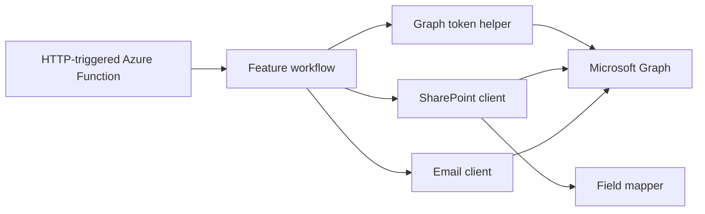

# Invoice Tracker Demo

This repository is a work-in-progress Azure automation project built around a simple idea: use Azure Functions to run invoice reminder workflows against invoice data stored in SharePoint, with Microsoft Graph handling both data access and email delivery.

It is also being shaped as a reusable template repo. The goal is not just to prove that one reminder can be sent, but to establish a maintainable structure for building multiple reminder workflows with shared Azure infrastructure, deployment automation, security defaults, and integration clients.

## What This Project Demonstrates

- Azure Functions v4 with Node.js and TypeScript
- Bicep-based Azure infrastructure
- GitHub Actions deployment using OIDC instead of static Azure secrets
- GitHub Actions test automation for the Functions app
- Microsoft Graph app-only authentication
- SharePoint list reads via Graph
- Email sending via Graph
- Node.js built-in tests for workflow, handler, mapper, and client behavior
- Separation of concerns between function handlers, feature workflows, integration clients, and field mapping

## Current Status

The repository is intentionally ahead in architecture and deployment setup, while the main business workflow is still being filled in.

Implemented now:

- Azure infrastructure for a Linux Function App, Storage Account, Key Vault, Log Analytics, Application Insights, and a user-assigned managed identity
- GitHub Actions workflows for validation, function tests, and environment-based deployment
- Graph token acquisition helper that accepts explicit config
- SharePoint client for reading list items with explicit IDs and filter input
- Email client for Graph `sendMail`
- Mapping layer for converting SharePoint internal fields into invoice-friendly names
- Azure Function handler and workflow for the overdue reminder flow
- Automated tests covering workflow behavior, reminder handler setup, field mapping, and Graph client error handling

Still in progress:

- Business rules for filtering, pacing, and duplicate-send protection
- Delivery confirmation beyond Graph request acceptance
- Broader integration and end-to-end coverage against live Azure and Graph dependencies

## Architecture

The repo is structured around a thin-handler pattern.

- `functions/` holds Azure Function entrypoints and trigger registration
- `functions/<feature>/` holds feature-specific business workflow code
- `clients/` holds external I/O code for Graph and SharePoint access
- `tools/` holds shared low-level helpers such as auth/token acquisition
- `mapper/` holds transformations from raw SharePoint fields to application-friendly objects

In the current implementation:

- the function registration layer loads JSON-backed reminder config and registers one Azure Function per config entry
- each generated handler reads `process.env` and wires explicit workflow dependencies
- the workflow receives typed input plus injected dependencies
- the workflow renders the templates with invoice-specific values such as `{ClientName}`, `{InvoiceNumber}`, and `{DueDate}`
- token acquisition and SharePoint reads fail fast because they are prerequisites for the whole run
- email sends return structured results so a single failed reminder does not abort the batch, and the email client retries transient DNS failures with a short delay
- the workflow calls the email client directly and treats each send result as item-scoped
- the workflow reads SharePoint items, skips rows without `ClientEmail`, and reports matched/sent/skipped/failed counts
- the clients and token helper operate on explicit parameters instead of reading runtime settings directly

This keeps transport concerns, business logic, integration logic, and data transformation from collapsing into a single file.


```mermaid
flowchart LR
  A["HTTP-triggered Azure Function"] --> B["Feature workflow"]
  B --> C["Graph token helper"]
  B --> D["SharePoint client"]
  D --> E["Field mapper"]
  B --> F["Email client"]
  C --> G["Microsoft Graph"]
  D --> G
  F --> G
```

## Repository Layout

- `infra/`
  - Bicep template and per-environment parameter files
- `invoice-tracker-functions/`
  - Azure Functions application
- `invoice-tracker-functions/src/functions/`
  - Function handlers and feature-local workflow folders
- `invoice-tracker-functions/src/clients/`
  - Graph-backed integration clients
- `invoice-tracker-functions/src/tools/`
  - Shared helper modules
- `invoice-tracker-functions/src/mapper/`
  - SharePoint-to-domain mapping code
- `docs/`
  - Step-by-step setup, deployment, troubleshooting, and handover notes
- `sample-data/`
  - Demo invoice data for SharePoint import/testing

## Key Files

- [infra/main.bicep](./infra/main.bicep)
- [invoice-tracker-functions/src/functions/sendOverdueReminderEmails.ts](./invoice-tracker-functions/src/functions/sendOverdueReminderEmails.ts)
- [invoice-tracker-functions/src/functions/sendOverdueReminderEmails/createReminderHandler.ts](./invoice-tracker-functions/src/functions/sendOverdueReminderEmails/createReminderHandler.ts)
- [invoice-tracker-functions/src/functions/sendOverdueReminderEmails/reminderHandlerConfigs.json](./invoice-tracker-functions/src/functions/sendOverdueReminderEmails/reminderHandlerConfigs.json)
- [invoice-tracker-functions/src/functions/sendOverdueReminderEmails/runOverdueReminderEmailsWorkflow.ts](./invoice-tracker-functions/src/functions/sendOverdueReminderEmails/runOverdueReminderEmailsWorkflow.ts)
- [invoice-tracker-functions/src/clients/sharepointClient.ts](./invoice-tracker-functions/src/clients/sharepointClient.ts)
- [invoice-tracker-functions/src/clients/emailClient.ts](./invoice-tracker-functions/src/clients/emailClient.ts)
- [invoice-tracker-functions/src/tools/getGraphAccessToken.ts](./invoice-tracker-functions/src/tools/getGraphAccessToken.ts)
- [invoice-tracker-functions/src/tools/errorHandlers.ts](./invoice-tracker-functions/src/tools/errorHandlers.ts)
- [invoice-tracker-functions/src/mapper/mapInvoiceFields.ts](./invoice-tracker-functions/src/mapper/mapInvoiceFields.ts)
- [invoice-tracker-functions/tests/](./invoice-tracker-functions/tests/)
- [.github/workflows/test-functions.yml](./.github/workflows/test-functions.yml)
- [scripts/bootstrap-client.sh](./scripts/bootstrap-client.sh)

## Local Development

Prerequisites:

- Node.js 22
- npm
- Azure Functions Core Tools
- Azure CLI

Use the pinned Node version:

```bash
nvm use
```

Install and run the function app:

```bash
cd invoice-tracker-functions
npm ci
npm run start
```

Run the local quality checks before pushing:

```bash
cd invoice-tracker-functions
npm run typecheck
npm test
```

`npm test` performs a clean rebuild and then runs the Node.js test suite in `invoice-tracker-functions/tests/`.

The function app reads runtime configuration from `invoice-tracker-functions/local.settings.json` when running locally. The main settings used by the current integration layer are:

- `GRAPH_TENANT_ID`
- `GRAPH_CLIENT_ID`
- `GRAPH_CLIENT_SECRET`
- `GRAPH_SCOPE`
- `SHAREPOINT_SITE_ID`
- `SHAREPOINT_LIST_ID`
- `SHARED_MAILBOX`

The current HTTP function can be invoked locally with:

```bash
curl -X POST http://localhost:7071/api/send-overdue-reminder-email
```

The reminder subject, body, and configured filter now come from:

- [reminderHandlerConfigs.json](./invoice-tracker-functions/src/functions/sendOverdueReminderEmails/reminderHandlerConfigs.json)

The endpoint returns a workflow summary with `status`, `matchedCount`, `sentCount`, `skippedCount`, and `failedCount`.

`sentCount` reflects Graph `sendMail` requests accepted with HTTP `202`. It does not guarantee final mailbox delivery.

## Azure Deployment

The deployment path is designed for repeatability across environments and client projects.

1. Update the correct parameter file in `infra/`
2. Bootstrap the Azure resource group and initial infrastructure
3. Configure GitHub environment variables and OIDC federation
4. Push to the target branch to deploy the function app

Bootstrap dev infrastructure:

```bash
./scripts/bootstrap-client.sh dev
```

The GitHub workflows currently included are:

- `.github/workflows/validate-template.yml`
- `.github/workflows/test-functions.yml`
- `.github/workflows/deploy-dev.yml`
- `.github/workflows/deploy-prod.yml`

`test-functions.yml` runs on pull requests that touch `invoice-tracker-functions/`, and on pushes that change the Functions app or the workflow itself. It installs dependencies, runs `npm run typecheck`, and then runs `npm test`.

## Docs Map

For the full setup and handover path, read these in order:

1. [docs/00-start-here.md](./docs/00-start-here.md)
2. [docs/01-bootstrap-dev.md](./docs/01-bootstrap-dev.md)
3. [docs/02-github-oidc-deploy.md](./docs/02-github-oidc-deploy.md)
4. [docs/03-promote-to-prod.md](./docs/03-promote-to-prod.md)
5. [docs/04-graph-sharepoint-integration.md](./docs/04-graph-sharepoint-integration.md)
6. [docs/05-secrets-runtime-local.md](./docs/05-secrets-runtime-local.md)
7. [docs/06-troubleshooting.md](./docs/06-troubleshooting.md)
8. [docs/07-security-handover.md](./docs/07-security-handover.md)

## Why It Is Structured This Way

This project is intended to support multiple automation flows, not just one endpoint. That is why the repo is split into reusable infrastructure and integration modules on one side, and feature-specific workflow folders on the other. The design choice is deliberate: it should be easy to add another reminder flow with different SharePoint filters, different email rules, and different orchestration logic without rewriting the foundation each time.

The current email templating pattern supports that goal:

- each reminder endpoint can be configured from JSON with its own subject/body templates and filter
- the shared workflow renders those templates with invoice data at runtime
- the email client only sends the final rendered strings

## Next Steps

- Add higher-level integration tests against non-production dependencies
- Introduce idempotency safeguards to reduce duplicate sends
- Improve operational visibility with richer logs and alerts
- Extend the template to support multiple reminder workflows cleanly

## Deep Reference

Long-form operational notes live in [knowledgeBase.md](./knowledgeBase.md).
