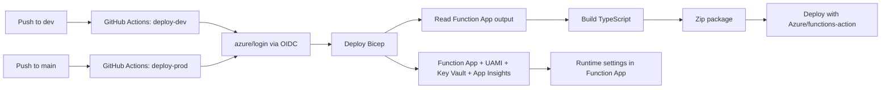

# Cloud Consultancy Template Knowledge Base.

This repository is a **client-delivery template** for deploying an Azure Function solution with:

- Infrastructure as Code (Bicep)
- CI/CD via GitHub Actions
- Passwordless Azure auth via OIDC
- Managed identity + Key Vault baseline for runtime security
- A repeatable onboarding path for client Microsoft 365/Graph integration

Use this document as the operational source of truth for new client projects.

---

## 1. Template Goal

When you clone this repo for a new client, you should be able to:

1. Provision a client environment quickly.
2. Deploy app + infra from GitHub with no static cloud secrets.
3. Hand over a documented, supportable environment.
4. Extend into Microsoft 365 automation safely.

---

## 2. Repository Layout

- `infra/main.bicep`
  - Provisions storage, Linux Consumption plan, Function App, user-assigned managed identity, Key Vault, Log Analytics, and Application Insights.
- `infra/main.parameters.dev.json`
  - Dev environment parameter file used by `deploy-dev.yml`.
- `infra/main.parameters.prod.json`
  - Prod environment parameter file used by `deploy-prod.yml`.
- `.github/workflows/deploy-dev.yml`
  - Deploys infra and function code to `dev`.
- `.github/workflows/deploy-prod.yml`
  - Deploys infra and function code to `prod`.
- `.github/workflows/validate-template.yml`
  - PR validation workflow (TypeScript + Bicep syntax checks).
- `my-func-api/src/functions/hello.ts`
  - Sample HTTP function showing runtime configuration usage.
- `sample-data/invoice-tracker-au-sharepoint-import.xlsx`
  - SharePoint import-ready demo data with reminder-control columns.
- `sample-data/invoice-tracker-au-sharepoint-import.csv`
  - CSV copy of the same import-ready dataset.
- `scripts/bootstrap-client.sh`
  - One-command bootstrap for a new client resource group + deployment.
- `.nvmrc`
  - Local Node version pin for consistency.

---

## 3. Architecture Overview



---

## 4. Core Standards (Template Defaults)

1. Runtime: Azure Functions v4 on Node 22.

- As of February 24, 2026: Node 20 expected end of support is April 30, 2026; Node 22 is April 30, 2027.

2. Auth: GitHub to Azure via OIDC (`azure/login@v2`), no client secret in workflow.
3. Packaging: Zip only deployable assets (`host.json`, `package*.json`, `dist`, `node_modules`).
4. Telemetry: `APPLICATIONINSIGHTS_CONNECTION_STRING` (not instrumentation key-only setup).
5. Secret strategy:

- Keep secrets in Key Vault.
- Use managed identity for runtime access.

6. Naming safety:

- Bicep normalizes/truncates prefixes for storage/key vault/function naming constraints.

---

## 5. New Client Onboarding (Fast Path)

### 5.1 Clone Template and Rename Repo

1. Create a new repository from this template.
2. Clone it locally.
3. Set new remote.

### 5.2 Prerequisites

Install and verify:

```bash
node -v
npm -v
func --version
az --version
git --version
```

### 5.3 Register Required Azure Resource Providers (One-Time Per Subscription)

Run with a subscription-level admin identity:

```bash
az account set --subscription <subscription-id>
az provider register --namespace Microsoft.Storage
az provider register --namespace Microsoft.Web
az provider register --namespace Microsoft.ManagedIdentity
az provider register --namespace Microsoft.KeyVault
az provider register --namespace Microsoft.Insights
az provider register --namespace Microsoft.OperationalInsights
```

Confirm at least `Microsoft.KeyVault` is registered:

```bash
az provider show --namespace Microsoft.KeyVault --query registrationState -o tsv
```

Expected output: `Registered`.

### 5.4 Set Local Node Version

```bash
nvm use
```

If Node 22 is not installed:

```bash
nvm install 22
nvm use 22
```

### 5.5 Bootstrap Azure Resources

Use the helper script:

```bash
./scripts/bootstrap-client.sh \
  dev
```

The script will:

1. Ensure Azure login/session.
2. Use your current Azure CLI subscription (or an optional subscription override argument).
3. Create resource group `rg-<namePrefix>-<environmentName>` by default (or optional resource-group override argument).
4. Deploy `infra/main.bicep` with `infra/main.parameters.dev.json`.
5. Print key outputs.
6. Print the GitHub environment variables you need to configure.

### 5.6 Set Infrastructure Parameters (Version-Controlled)

Update these files before deployment:
- `infra/main.parameters.dev.json`
- `infra/main.parameters.prod.json`

Required Graph/SharePoint parameters in each file:
- `graphTenantId`
- `graphClientId`
- `graphClientSecretName`
- `graphScope`
- `sharePointSiteId`
- `sharePointListId`

Recommended naming style for `namePrefix`:
- `<client>-<app>` (example: `acme-invoice`)
- This produces readable names like `func-acme-invoice-dev-<uniqueSuffix>`.

### 5.7 Configure GitHub Environment

Create environment `dev` and set:

- `AZURE_CLIENT_ID`
- `AZURE_TENANT_ID`
- `AZURE_SUBSCRIPTION_ID`
- `AZURE_RG`

Create environment `prod` with the same variable names, but production values:

- `AZURE_RG` should be production resource group.

Important:
- `AZURE_CLIENT_ID` must be the **deployment app registration** client ID (not the Function App managed identity client ID).

### 5.8 Create Deployment App Identity (Entra App Registration)

Create one Entra app registration per environment (recommended), for example:
- `gh-deployer-<client>-dev`
- `gh-deployer-<client>-prod`

Capture:
- Application (client) ID -> `AZURE_CLIENT_ID`
- Directory (tenant) ID -> `AZURE_TENANT_ID`

If needed, create a service principal for the app registration:

```bash
az ad sp create --id <AZURE_CLIENT_ID>
```

### 5.9 Configure Federated Credential (OIDC)

In the deployment Entra app registration:

1. Add federated credential.
2. Scenario: GitHub Actions deploying Azure resources.
3. Scope must match org/repo/environment used by workflow.
4. Example subject values:
   - `repo:<org>/<repo>:environment:dev`
   - `repo:<org>/<repo>:environment:prod`

### 5.10 Grant Azure RBAC to Deployment Identity

Grant Contributor on the target resource group (run once per environment):

```bash
az role assignment create \
  --assignee <AZURE_CLIENT_ID> \
  --role Contributor \
  --scope /subscriptions/<AZURE_SUBSCRIPTION_ID>/resourceGroups/<AZURE_RG>
```

Verify:

```bash
az role assignment list \
  --assignee <AZURE_CLIENT_ID> \
  --scope /subscriptions/<AZURE_SUBSCRIPTION_ID>/resourceGroups/<AZURE_RG> \
  -o table
```

### 5.11 First Deployment

```bash
git checkout -b dev
git add .
git commit -m "Initialize client deployment"
git push -u origin dev
```

Then monitor Actions tab for `Deploy Dev (Infra + Function)`.

### 5.12 Production Deployment Setup

1. Bootstrap production resources (separate RG recommended):

```bash
./scripts/bootstrap-client.sh \
  prod
```

2. Update `infra/main.parameters.prod.json` for production naming/tags.
3. Ensure `prod` GitHub environment exists with required variables.
4. Add a federated credential for `prod` environment in the deployment app registration.
5. Configure environment protection rules for `prod` (required reviewers recommended).
6. Deploy to production by merging/pushing to `main`.
7. Monitor `Deploy Prod (Infra + Function)` workflow run.

---

## 6. Per-Client Customization Matrix

Set these before first deployment:

- Naming + tags: `namePrefix`, `environmentName`, and `tags` in Bicep parameters.
- Resource group convention: `rg-<client>-invoice-<env>`.
- Branching: `dev` for active delivery, `main` for protected release.
- Environment protections: required reviewers in GitHub environments for `main`/`prod`.
- Region policy: keep per-client data residency requirements documented.

---

## 7. Infrastructure Details (What Bicep Creates)

1. Storage account for Functions host storage.
2. Log Analytics workspace.
3. Workspace-based Application Insights component.
4. Linux Consumption plan.
5. User-assigned managed identity.
6. Key Vault (RBAC mode).
7. Function App configured for Node 22.
8. Role assignment: Key Vault Secrets User to the user-assigned identity.

Key outputs:

- `functionAppResourceName`
- `functionAppDefaultHostName`
- `identityClientId`
- `keyVaultUri`
- `appInsightsConnectionString`

---

## 8. CI/CD Workflows

### 8.1 `deploy-dev.yml`

Trigger:

- Push to `dev`
- Manual dispatch

Flow:

1. Azure login via OIDC.
2. Deploy infra using `infra/main.parameters.dev.json`, then fetch function app name from outputs.
3. Build function code.
4. Prune dev dependencies.
5. Zip deployable artifacts.
6. Deploy via `Azure/functions-action@v1`.

Security note:

- `AZURE_CORE_OUTPUT=none` is set on the infra deployment step to reduce accidental CLI output leakage.

### 8.2 `deploy-prod.yml`

Trigger:

- Push to `main`
- Manual dispatch

Flow:

1. Azure login via OIDC.
2. Deploy infra using `infra/main.parameters.prod.json`, then fetch function app name from outputs.
3. Build function code.
4. Prune dev dependencies.
5. Zip deployable artifacts.
6. Deploy via `Azure/functions-action@v1`.

Security note:

- Use GitHub Environment protection rules on `prod`.

### 8.3 `validate-template.yml`

Trigger:

- Pull requests to `dev` or `main`
- Manual dispatch

Checks:

1. `npm ci`
2. `npm run typecheck`
3. `npm run build`
4. `az bicep build --file infra/main.bicep`

---

## 9. Runtime Configuration in App Code

`hello.ts` demonstrates reading infra-driven app settings:

- `CLIENT_CODE`
- `ENVIRONMENT_NAME`

`sharepointListTest.ts` demonstrates reading Graph + SharePoint integration settings:

- `GRAPH_TENANT_ID`
- `GRAPH_CLIENT_ID`
- `GRAPH_CLIENT_SECRET`
- `SHAREPOINT_SITE_ID`
- `SHAREPOINT_LIST_ID`

This teaches how Bicep app settings flow into runtime behavior.

Local test:

```bash
cd my-func-api
npm ci
npm run start
```

Examples:

```bash
curl "http://localhost:7071/api/hello?name=Alex"
```

```bash
curl -X POST "http://localhost:7071/api/hello" \
  -H "Content-Type: application/json" \
  -d '{"name":"Alex"}'
```

Graph/SharePoint connectivity test endpoint:

```bash
curl "http://localhost:7071/api/sharepoint-list-test?top=3"
```

---

## 10. Client M365 Integration Playbook (SharePoint List + Graph)

Use this after base Azure deployment is stable.

### 10.1 Identity Model (Keep Roles Separate)

Use three identities with different purposes:

1. Deployment identity (GitHub OIDC app registration):
- Used only by GitHub Actions to deploy Azure resources.

2. Graph runtime identity (app registration):
- Used by Function code at runtime.
- App permissions: `Sites.Selected` (and `Mail.Send` only if sending emails via Graph).

3. Admin grant identity (human admin session, Graph Explorer, or dedicated admin app):
- Used only to grant site-level permissions to the runtime app.
- Needs enough privilege to call `POST /sites/{siteId}/permissions` (for example `Sites.FullControl.All` in admin context).

### 10.2 Create Graph Runtime App Registration

1. Create app registration per environment (recommended):
- `app-<client>-invoice-graph-dev`
- `app-<client>-invoice-graph-prod`

2. Capture:
- `GRAPH_CLIENT_ID` = Application (client) ID
- `GRAPH_TENANT_ID` = Directory (tenant) ID

3. API permissions:
- Microsoft Graph -> Application permissions -> `Sites.Selected`
- Optional: Microsoft Graph -> Application permissions -> `Mail.Send`

4. Click `Grant admin consent` for the tenant.

5. Create a client secret and capture the **Value** (not Secret ID).

### 10.3 Prepare SharePoint Demo List

1. Create list in a team site path (`/sites/...`), not personal OneDrive path (`/personal/...`).
2. Import sample data for demos:
- `sample-data/invoice-tracker-au-sharepoint-import.xlsx`
3. Use Yes/No columns for reminder controls:
- `ReminderEnabled`
- `DoNotContact`
- `EscalationEnabled`

### 10.4 Resolve Site and List IDs

1. Get user token for discovery:

```bash
TOKEN=$(az account get-access-token --resource-type ms-graph --query accessToken -o tsv)
```

2. Resolve site ID:

```bash
curl -sS \
  -H "Authorization: Bearer $TOKEN" \
  "https://graph.microsoft.com/v1.0/sites/<tenant>.sharepoint.com:/sites/<site-name>?$select=id,webUrl,displayName"
```

3. Resolve list ID:

```bash
SITE_ID='<site-id>'
curl -sS -G \
  -H "Authorization: Bearer $TOKEN" \
  --data-urlencode "\$select=id,displayName" \
  "https://graph.microsoft.com/v1.0/sites/${SITE_ID}/lists"
```

### 10.5 Grant Site Access to Runtime App (`Sites.Selected`)

Grant is at **site** scope, not list scope.

1. Prepare required values:

```bash
SITE_ID='<site-id>'
TARGET_APP_ID='<graph-runtime-client-id>'
TARGET_APP_NAME='app-<client>-invoice-graph-dev'
```

2. Get an admin token used for the grant call:
- Option A: Graph Explorer signed in as admin (copy token from Graph Explorer).
- Option B: Azure CLI token from an admin user session.

```bash
ADMIN_TOKEN=$(az account get-access-token --resource-type ms-graph --query accessToken -o tsv)
echo "Admin token length: ${#ADMIN_TOKEN}"
```

3. Create site permission grant with `POST /sites/{siteId}/permissions`:

```bash
curl -sS -X POST \
  -H "Authorization: Bearer ${ADMIN_TOKEN}" \
  -H "Content-Type: application/json" \
  "https://graph.microsoft.com/v1.0/sites/${SITE_ID}/permissions" \
  -d "{
    \"roles\": [\"write\"],
    \"grantedToIdentitiesV2\": [
      {
        \"application\": {
          \"id\": \"${TARGET_APP_ID}\",
          \"displayName\": \"${TARGET_APP_NAME}\"
        }
      }
    ]
  }" | jq .
```

Expected success shape:
- `roles` contains `write`
- `grantedToIdentitiesV2[0].application.id` equals your runtime app ID
- A permission `id` is returned (keep it if you want to delete this grant later)

4. Verify site permission grant exists:

```bash
curl -sS \
  -H "Authorization: Bearer ${ADMIN_TOKEN}" \
  "https://graph.microsoft.com/v1.0/sites/${SITE_ID}/permissions" | jq .
```

Optional focused verification for the target runtime app:

```bash
curl -sS \
  -H "Authorization: Bearer ${ADMIN_TOKEN}" \
  "https://graph.microsoft.com/v1.0/sites/${SITE_ID}/permissions" \
  | jq --arg APPID "$TARGET_APP_ID" '.value[] | select(.grantedToIdentitiesV2[0].application.id == $APPID) | {id,roles,app:.grantedToIdentitiesV2[0].application}'
```

5. Important behavior notes:
- This grant is on the **site**, not directly on a list.
- Runtime app must still have Graph Application permission `Sites.Selected` with admin consent.
- Using the runtime app token for this POST call usually fails; use an admin token/context.

### 10.6 Validate Runtime Token and Access

1. Request runtime app token:

```bash
TOKEN_JSON=$(curl -s -X POST "https://login.microsoftonline.com/${GRAPH_TENANT_ID}/oauth2/v2.0/token" \
  -H "Content-Type: application/x-www-form-urlencoded" \
  -d "client_id=${GRAPH_CLIENT_ID}" \
  -d "client_secret=${GRAPH_CLIENT_SECRET}" \
  -d "scope=https%3A%2F%2Fgraph.microsoft.com%2F.default" \
  -d "grant_type=client_credentials")
export APP_TOKEN=$(echo "$TOKEN_JSON" | jq -r .access_token)
```

2. Confirm token has Graph app-role claim:

```bash
python3 - <<'PY'
import os, json, base64
t=os.environ["APP_TOKEN"].split(".")[1]
t += "=" * (-len(t)%4)
claims=json.loads(base64.urlsafe_b64decode(t))
print("appid:", claims.get("appid"))
print("roles:", claims.get("roles"))
PY
```

Expected:
- `roles` includes `Sites.Selected`

3. Test list read with app token:

```bash
SITE_ID='<site-id>'
LIST_ID='<list-id>'

curl -sS -G \
  -H "Authorization: Bearer ${APP_TOKEN}" \
  --data-urlencode "\$top=3" \
  --data-urlencode "\$expand=fields(\$select=InvoiceNumber,Status,DueDate,Balance,ReminderEnabled,DoNotContact,ClientEmail,NextReminderDate)" \
  "https://graph.microsoft.com/v1.0/sites/${SITE_ID}/lists/${LIST_ID}/items"
```

### 10.7 Store Graph Secret in Key Vault and Wire Function Settings

1. Store runtime app secret in Key Vault:
- Secret name must match `graphClientSecretName` in your parameters file.
- Template default: `GRAPH-CLIENT-SECRET`

```bash
KV_NAME='<key-vault-name>'
GRAPH_CLIENT_SECRET_NAME='GRAPH-CLIENT-SECRET'
az keyvault secret set \
  --vault-name "$KV_NAME" \
  --name "$GRAPH_CLIENT_SECRET_NAME" \
  --value '<graph-client-secret-value>'
```

2. If portal shows unauthorized on Key Vault secrets, assign yourself a data role:
- `Key Vault Secrets Officer` (for setup)

```bash
KV_SCOPE=$(az keyvault show -n "$KV_NAME" --query id -o tsv)
USER_OBJECT_ID=$(az ad signed-in-user show --query id -o tsv)

az role assignment create \
  --assignee-object-id "$USER_OBJECT_ID" \
  --assignee-principal-type User \
  --role "Key Vault Secrets Officer" \
  --scope "$KV_SCOPE"
```

3. Ensure Function runtime identity can read secrets:
- Assign `Key Vault Secrets User` on the vault to the Function app identity.
- Bicep already sets `properties.keyVaultReferenceIdentity` to the user-assigned identity.
- Run the `az resource update` command below only for older environments created before this template change.

```bash
RG='<resource-group>'
APP_NAME='<function-app-name>'
UAMI_ID=$(az functionapp identity show -g "$RG" -n "$APP_NAME" --query "keys(userAssignedIdentities)[0]" -o tsv)
UAMI_PRINCIPAL_ID=$(az identity show --ids "$UAMI_ID" --query principalId -o tsv)

az role assignment create \
  --assignee-object-id "$UAMI_PRINCIPAL_ID" \
  --assignee-principal-type ServicePrincipal \
  --role "Key Vault Secrets User" \
  --scope "$KV_SCOPE"

# Legacy fix only (not required for newly deployed environments from this template)
az resource update \
  -g "$RG" \
  -n "$APP_NAME" \
  --resource-type "Microsoft.Web/sites" \
  --set properties.keyVaultReferenceIdentity="$UAMI_ID"
```

4. Set Graph/SharePoint values in parameter files (not manual app-settings commands):
- `graphTenantId`
- `graphClientId`
- `graphClientSecretName`
- `sharePointSiteId`
- `sharePointListId`

These are pushed into Function App settings by Bicep on every deploy.

5. Restart Function App after app settings / Key Vault identity changes.

Note:
- `az functionapp config appsettings set` intentionally returns `"value": null` for all settings in CLI output. This is masking behavior, not a failed update.

### 10.8 Local Development Behavior

1. Keep same setting names locally.
2. In `local.settings.json`, use real local secret value for `GRAPH_CLIENT_SECRET`.
3. Do not use Key Vault reference syntax in local settings; local runtime does not resolve it automatically.

### 10.9 Operational Controls

1. Rotate Graph client secret before expiry.
2. Keep deployment app and runtime Graph app separated.
3. Audit app permissions and site grants quarterly.
4. Remove stale grants/app registrations during client offboarding.

---

## 11. Security Guardrails Checklist

Before go-live:

1. OIDC used for deployment (no hardcoded cloud secrets).
2. Protected GitHub environments enabled for release branches.
3. Least privilege RBAC confirmed for deployment identity.
4. Key Vault access restricted to managed identity + admins.
5. App settings reviewed for secrets and leakage risk.
6. Deployment logs reviewed for sensitive output.
7. Function auth model reviewed (`anonymous` is demo-only).

---

## 12. Productionization Backlog (Template Evolution)

Priority upgrades:

1. Add `test` and `prod` workflows with required reviewers.
2. Add smoke test job after deployment.
3. Move to identity-based host storage when project requirements allow.
4. Add alert rules (Function failures, 5xx spikes, failed deployments).
5. Add backup/DR documentation and recovery runbook.
6. Add a permission manifest file for Graph scopes per integration module.

---

## 13. Troubleshooting

- OIDC login fails (`AADSTS700213`):
- Federated credential subject/repo/environment mismatch. Recheck exact values.

- Azure login step fails with `No subscriptions found for ***`:
- Usually means the deployment app identity lacks RBAC on the target scope, or the workflow is using the wrong tenant/subscription/app ID.
- Recheck:
  - `AZURE_CLIENT_ID`, `AZURE_TENANT_ID`, `AZURE_SUBSCRIPTION_ID`, `AZURE_RG` in the GitHub environment.
  - Contributor assignment exists for `<AZURE_CLIENT_ID>` on the target resource group.

- Graph token request fails with `AADSTS7000215` / `invalid_client`:
- Usually means wrong secret value (using Secret ID instead of Secret Value), expired secret, or wrong app ID.
- Recreate secret in app registration and use the **Value** field.

- Graph token decodes with `roles: None`:
- Admin consent for application permission is missing or wrong permission type was added.
- Ensure Microsoft Graph **Application** permission `Sites.Selected` is present and `Grant admin consent` was completed.

- Graph API returns `generalException` for runtime app token:
- Most often caused by missing app-role claim, missing site grant, or propagation delay.
- Recheck:
  - Token contains `roles: ['Sites.Selected']`
  - Site permission grant exists in `GET /sites/{siteId}/permissions`
  - Wait 2-5 minutes after permission/consent changes and retry.

- Function endpoint fails with `Graph token request failed ... invalid_client`, but manual token test with Key Vault secret value succeeds:
- Function runtime is likely not resolving Key Vault reference with the intended managed identity.
- Recheck:
  - Function user-assigned identity has `Key Vault Secrets User` on vault.
  - `properties.keyVaultReferenceIdentity` is set to that identity resource ID.
  - Function app was restarted after settings/identity updates.

- Function endpoint returns `Missing required app settings for Graph/SharePoint integration` after a redeploy:
- Infra deploy likely replaced app settings from Bicep and Graph/SharePoint parameters are blank or placeholders.
- Recheck `infra/main.parameters.<env>.json` values for:
  - `graphTenantId`
  - `graphClientId`
  - `graphClientSecretName`
  - `sharePointSiteId`
  - `sharePointListId`

- Infrastructure deploy fails with `MissingSubscriptionRegistration` for `Microsoft.KeyVault`:
- The subscription has not registered the Key Vault resource provider yet.
- Register it once at subscription scope:
  - `az provider register --namespace Microsoft.KeyVault`

- Infrastructure deploy fails on `Microsoft.Authorization/roleAssignments/write`:
- Your deploy identity has resource deployment rights but not RBAC assignment rights.
- Keep `enableKeyVaultRoleAssignment=false` in the active parameters file, or grant one of these roles at RG/subscription scope:
  - `User Access Administrator`
  - `Role Based Access Control Administrator`
  - `Owner`

- Workflow cannot find function app output:
- Confirm `functionAppResourceName` output exists and deployment succeeded.

- Function deploy succeeds but app fails at runtime:
- Confirm `host.json` is at zip root and package includes runtime dependencies.

- Key Vault reference fails:
- Check RBAC role assignment and vault network restrictions.

- Key Vault portal shows `You are unauthorized to view these contents` even though you are `Owner`:
- `Owner` is management-plane authorization and does not automatically provide secrets data-plane access in RBAC mode.
- Assign a Key Vault data role to your user (for example `Key Vault Secrets Officer`) and wait for propagation.

- Graph calls fail with 403:
- Verify tenant admin consent, scope type (delegated vs application), and token flow.

---

## 14. Handover Checklist (Per Client)

Deliver these artifacts at project handover:

1. Repository URL + branch policy summary.
2. Environment variable inventory.
3. Azure resource inventory + tagging standard.
4. App registration inventory (deployment + M365 integration).
5. Permission matrix (Azure RBAC + Graph permissions).
6. Incident response/runbook links.
7. Credential and certificate rotation plan.
8. Support ownership and escalation contacts.

---

## 15. Useful Commands

Deploy infra manually:

```bash
az deployment group create \
  -g <resource-group> \
  -f infra/main.bicep \
  -p @infra/main.parameters.dev.json
```

Build API locally:

```bash
cd my-func-api
npm ci
npm run validate
```

Validate Bicep locally:

```bash
AZURE_CONFIG_DIR=/tmp/azcfg az bicep build --file infra/main.bicep
```

---

## 16. Authoritative References

- Azure Functions supported languages and support dates:
  - https://learn.microsoft.com/en-us/azure/azure-functions/supported-languages
- Azure Functions runtime versions:
  - https://learn.microsoft.com/en-us/azure/azure-functions/functions-versions
- Azure Functions app settings reference:
  - https://learn.microsoft.com/en-us/azure/azure-functions/functions-app-settings
- App Insights connection strings:
  - https://learn.microsoft.com/en-us/azure/azure-monitor/app/connection-strings
- Zip deploy requirements:
  - https://learn.microsoft.com/en-us/azure/azure-functions/deployment-zip-push
- Azure Login action (OIDC + security notes):
  - https://github.com/Azure/login
- GitHub to Azure OIDC guide:
  - https://learn.microsoft.com/en-us/azure/developer/github/connect-from-azure-openid-connect
- Key Vault references for App Service/Functions:
  - https://learn.microsoft.com/en-us/azure/app-service/app-service-key-vault-references
- Entra built-in role permissions:
  - https://learn.microsoft.com/en-us/entra/identity/role-based-access-control/permissions-reference
- Tenant-wide admin consent guidance:
  - https://learn.microsoft.com/en-us/entra/identity/enterprise-apps/grant-admin-consent
- Azure naming rules:
  - https://learn.microsoft.com/en-us/azure/azure-resource-manager/management/resource-name-rules
- Microsoft Graph list items:
  - https://learn.microsoft.com/en-us/graph/api/listitem-list?view=graph-rest-1.0
- Microsoft Graph site permissions (`POST /sites/{siteId}/permissions`):
  - https://learn.microsoft.com/en-us/graph/api/site-post-permissions?view=graph-rest-1.0&tabs=http
- Selected permissions overview (`Sites.Selected`, `Lists.SelectedOperations.Selected`):
  - https://learn.microsoft.com/en-us/graph/permissions-selected-overview
- Microsoft Graph paging:
  - https://learn.microsoft.com/en-us/graph/paging
