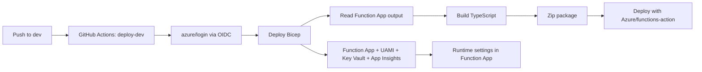

# Cloud Consultancy Template Knowledge Base

This repository is a **client-delivery template** for deploying an Azure Function solution with:
- Infrastructure as Code (Bicep)
- CI/CD via GitHub Actions
- Passwordless Azure auth via OIDC
- Managed identity + Key Vault baseline for runtime security
- A repeatable onboarding path for client Microsoft 365/Graph integration

Use this document as the operational source of truth for new client projects.

---

## 1. Template Goal

When you clone this repo for a new client, you should be able to:
1. Provision a client environment quickly.
2. Deploy app + infra from GitHub with no static cloud secrets.
3. Hand over a documented, supportable environment.
4. Extend into Microsoft 365 automation safely.

---

## 2. Repository Layout

- `infra/main.bicep`
  - Provisions storage, Linux Consumption plan, Function App, user-assigned managed identity, Key Vault, Log Analytics, and Application Insights.
- `infra/main.parameters.example.json`
  - Copyable parameter file for per-client values.
- `.github/workflows/deploy-dev.yml`
  - Deploys infra and function code to `dev`.
- `.github/workflows/validate-template.yml`
  - PR validation workflow (TypeScript + Bicep syntax checks).
- `my-func-api/src/functions/hello.ts`
  - Sample HTTP function showing runtime configuration usage.
- `scripts/bootstrap-client.sh`
  - One-command bootstrap for a new client resource group + deployment.
- `.nvmrc`
  - Local Node version pin for consistency.

---

## 3. Architecture Overview



---

## 4. Core Standards (Template Defaults)

1. Runtime: Azure Functions v4 on Node 22.
  - As of February 24, 2026: Node 20 expected end of support is April 30, 2026; Node 22 is April 30, 2027.
2. Auth: GitHub to Azure via OIDC (`azure/login@v2`), no client secret in workflow.
3. Packaging: Zip only deployable assets (`host.json`, `package*.json`, `dist`, `node_modules`).
4. Telemetry: `APPLICATIONINSIGHTS_CONNECTION_STRING` (not instrumentation key-only setup).
5. Secret strategy:
- Keep secrets in Key Vault.
- Use managed identity for runtime access.
6. Naming safety:
- Bicep normalizes/truncates prefixes for storage/key vault/function naming constraints.

---

## 5. New Client Onboarding (Fast Path)

### 5.1 Clone Template and Rename Repo
1. Create a new repository from this template.
2. Clone it locally.
3. Set new remote.

### 5.2 Prerequisites
Install and verify:

```bash
node -v
npm -v
func --version
az --version
git --version
```

### 5.3 Register Required Azure Resource Providers (One-Time Per Subscription)
Run with a subscription-level admin identity:

```bash
az account set --subscription <subscription-id>
az provider register --namespace Microsoft.Storage
az provider register --namespace Microsoft.Web
az provider register --namespace Microsoft.ManagedIdentity
az provider register --namespace Microsoft.KeyVault
az provider register --namespace Microsoft.Insights
az provider register --namespace Microsoft.OperationalInsights
```

Confirm at least `Microsoft.KeyVault` is registered:

```bash
az provider show --namespace Microsoft.KeyVault --query registrationState -o tsv
```

Expected output: `Registered`.

### 5.4 Set Local Node Version

```bash
nvm use
```

If Node 22 is not installed:

```bash
nvm install 22
nvm use 22
```

### 5.5 Bootstrap Azure Resources
Use the helper script:

```bash
./scripts/bootstrap-client.sh \
  <subscription-id> \
  rg-<client>-invoice-dev \
  australiaeast \
  <clientprefix> \
  dev
```

The script will:
1. Ensure Azure login/session.
2. Create resource group.
3. Deploy `infra/main.bicep`.
4. Print key outputs.
5. Print the GitHub environment variables you need to configure.

### 5.6 Configure GitHub Environment
Create environment `dev` and set:
- `AZURE_CLIENT_ID`
- `AZURE_TENANT_ID`
- `AZURE_SUBSCRIPTION_ID`
- `AZURE_RG`
- `NAME_PREFIX`
- `ENVIRONMENT_NAME` (example: `dev`)
- `ENABLE_KEYVAULT_ROLE_ASSIGNMENT` (default `false`; set `true` only if deploy identity has RBAC assignment permissions)

### 5.7 Configure Federated Credential (OIDC)
In the deployment Entra app registration:
1. Add federated credential.
2. Scenario: GitHub Actions deploying Azure resources.
3. Scope must match org/repo/environment used by workflow.

### 5.8 First Deployment

```bash
git checkout -b dev
git add .
git commit -m "Initialize client deployment"
git push -u origin dev
```

Then monitor Actions tab for `Deploy Dev (Infra + Function)`.

---

## 6. Per-Client Customization Matrix

Set these before first deployment:

- Naming + tags: `namePrefix`, `environmentName`, and `tags` in Bicep parameters.
- Resource group convention: `rg-<client>-invoice-<env>`.
- Branching: `dev` for active delivery, `main` for protected release.
- Environment protections: required reviewers in GitHub environments for `main`/`prod`.
- Region policy: keep per-client data residency requirements documented.

---

## 7. Infrastructure Details (What Bicep Creates)

1. Storage account for Functions host storage.
2. Log Analytics workspace.
3. Workspace-based Application Insights component.
4. Linux Consumption plan.
5. User-assigned managed identity.
6. Key Vault (RBAC mode).
7. Function App configured for Node 22.
8. Role assignment: Key Vault Secrets User to the user-assigned identity.

Key outputs:
- `functionAppResourceName`
- `functionAppDefaultHostName`
- `identityClientId`
- `keyVaultUri`
- `appInsightsConnectionString`

---

## 8. CI/CD Workflows

### 8.1 `deploy-dev.yml`
Trigger:
- Push to `dev`
- Manual dispatch

Flow:
1. Azure login via OIDC.
2. Deploy infra and fetch function app name from outputs.
3. Build function code.
4. Prune dev dependencies.
5. Zip deployable artifacts.
6. Deploy via `Azure/functions-action@v1`.

Security note:
- `AZURE_CORE_OUTPUT=none` is set at job level to reduce accidental CLI output leakage.

### 8.2 `validate-template.yml`
Trigger:
- Pull requests to `dev` or `main`
- Manual dispatch

Checks:
1. `npm ci`
2. `npm run typecheck`
3. `npm run build`
4. `az bicep build --file infra/main.bicep`

---

## 9. Runtime Configuration in App Code

`hello.ts` demonstrates reading infra-driven app settings:
- `CLIENT_CODE`
- `ENVIRONMENT_NAME`

This teaches how Bicep app settings flow into runtime behavior.

Local test:

```bash
cd my-func-api
npm ci
npm run start
```

Examples:

```bash
curl "http://localhost:7071/api/hello?name=Alex"
```

```bash
curl -X POST "http://localhost:7071/api/hello" \
  -H "Content-Type: application/json" \
  -d '{"name":"Alex"}'
```

---

## 10. Client M365 Integration Playbook

Use this after base Azure deployment is stable.

### 10.1 Access Model
1. Avoid standing high privilege where possible.
2. Prefer just-in-time elevation with approval trail.
3. Keep deployment identity and M365 integration identity separate.

### 10.2 Roles and Responsibilities
- Consultant team:
  - Define required Graph scopes and integration behavior.
  - Build and test integration code.
- Client admin team:
  - Grant tenant consent and approve requested permissions.
  - Own final approval of production permissions.

### 10.3 Create Integration App Registration
1. In client tenant, create app registration (single tenant).
2. Capture:
- Application (client) ID
- Directory (tenant) ID

### 10.4 Add Microsoft Graph Permissions
1. Add only required delegated/application permissions.
2. Document business reason per permission.
3. Request admin consent from authorized client admin role.
4. For Microsoft Graph application permissions, plan for a Privileged Role Administrator (or equivalent) to perform consent.

### 10.5 Store Integration Secrets/Certificates
1. Prefer certificate-based auth over client secret where feasible.
2. Store secrets/cert references in Key Vault.
3. Reference Key Vault from Function App settings.

### 10.6 Operational Controls
1. Audit sign-ins and app consent events.
2. Review permissions at least quarterly.
3. Rotate credentials/certificates on a defined schedule.

---

## 11. Security Guardrails Checklist

Before go-live:
1. OIDC used for deployment (no hardcoded cloud secrets).
2. Protected GitHub environments enabled for release branches.
3. Least privilege RBAC confirmed for deployment identity.
4. Key Vault access restricted to managed identity + admins.
5. App settings reviewed for secrets and leakage risk.
6. Deployment logs reviewed for sensitive output.
7. Function auth model reviewed (`anonymous` is demo-only).

---

## 12. Productionization Backlog (Template Evolution)

Priority upgrades:
1. Add `test` and `prod` workflows with required reviewers.
2. Add smoke test job after deployment.
3. Move to identity-based host storage when project requirements allow.
4. Add alert rules (Function failures, 5xx spikes, failed deployments).
5. Add backup/DR documentation and recovery runbook.
6. Add a permission manifest file for Graph scopes per integration module.

---

## 13. Troubleshooting

- OIDC login fails (`AADSTS700213`):
- Federated credential subject/repo/environment mismatch. Recheck exact values.

- Infrastructure deploy fails with `MissingSubscriptionRegistration` for `Microsoft.KeyVault`:
- The subscription has not registered the Key Vault resource provider yet.
- Register it once at subscription scope:
  - `az provider register --namespace Microsoft.KeyVault`

- Infrastructure deploy fails on `Microsoft.Authorization/roleAssignments/write`:
- Your deploy identity has resource deployment rights but not RBAC assignment rights.
- Keep `ENABLE_KEYVAULT_ROLE_ASSIGNMENT=false` (default), or grant one of these roles at RG/subscription scope:
  - `User Access Administrator`
  - `Role Based Access Control Administrator`
  - `Owner`

- Workflow cannot find function app output:
- Confirm `functionAppResourceName` output exists and deployment succeeded.

- Function deploy succeeds but app fails at runtime:
- Confirm `host.json` is at zip root and package includes runtime dependencies.

- Key Vault reference fails:
- Check RBAC role assignment and vault network restrictions.

- Graph calls fail with 403:
- Verify tenant admin consent, scope type (delegated vs application), and token flow.

---

## 14. Handover Checklist (Per Client)

Deliver these artifacts at project handover:
1. Repository URL + branch policy summary.
2. Environment variable inventory.
3. Azure resource inventory + tagging standard.
4. App registration inventory (deployment + M365 integration).
5. Permission matrix (Azure RBAC + Graph permissions).
6. Incident response/runbook links.
7. Credential and certificate rotation plan.
8. Support ownership and escalation contacts.

---

## 15. Useful Commands

Deploy infra manually:

```bash
az deployment group create \
  -g <resource-group> \
  -f infra/main.bicep \
  -p namePrefix=<prefix> environmentName=dev location=australiaeast
```

Build API locally:

```bash
cd my-func-api
npm ci
npm run validate
```

Validate Bicep locally:

```bash
AZURE_CONFIG_DIR=/tmp/azcfg az bicep build --file infra/main.bicep
```

---

## 16. Authoritative References

- Azure Functions supported languages and support dates:
  - https://learn.microsoft.com/en-us/azure/azure-functions/supported-languages
- Azure Functions runtime versions:
  - https://learn.microsoft.com/en-us/azure/azure-functions/functions-versions
- Azure Functions app settings reference:
  - https://learn.microsoft.com/en-us/azure/azure-functions/functions-app-settings
- App Insights connection strings:
  - https://learn.microsoft.com/en-us/azure/azure-monitor/app/connection-strings
- Zip deploy requirements:
  - https://learn.microsoft.com/en-us/azure/azure-functions/deployment-zip-push
- Azure Login action (OIDC + security notes):
  - https://github.com/Azure/login
- GitHub to Azure OIDC guide:
  - https://learn.microsoft.com/en-us/azure/developer/github/connect-from-azure-openid-connect
- Key Vault references for App Service/Functions:
  - https://learn.microsoft.com/en-us/azure/app-service/app-service-key-vault-references
- Entra built-in role permissions:
  - https://learn.microsoft.com/en-us/entra/identity/role-based-access-control/permissions-reference
- Tenant-wide admin consent guidance:
  - https://learn.microsoft.com/en-us/entra/identity/enterprise-apps/grant-admin-consent
- Azure naming rules:
  - https://learn.microsoft.com/en-us/azure/azure-resource-manager/management/resource-name-rules
