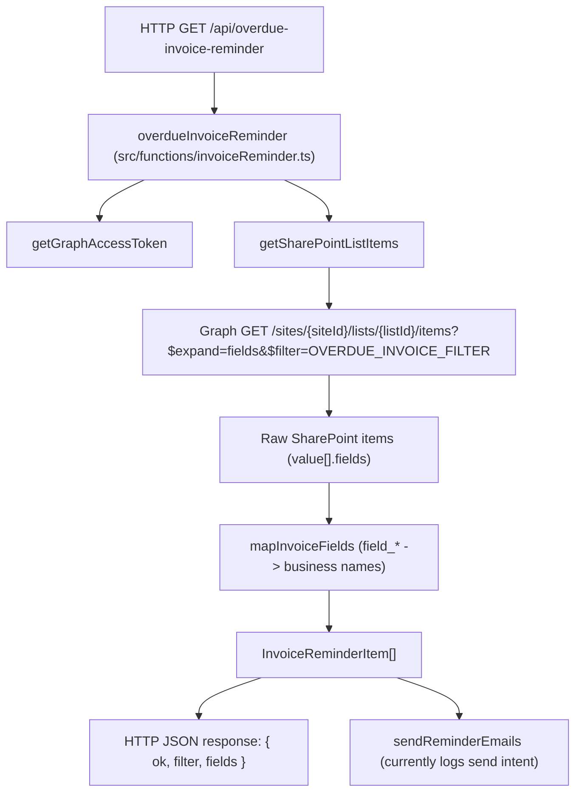

# Invoice Reminder Module

This folder contains the business logic for finding overdue invoices from a SharePoint list and shaping them into readable invoice objects.

## Files

- `getSharePointListItems.ts`
  - Calls Microsoft Graph to read SharePoint list items.
  - Applies the overdue filter (`OVERDUE_INVOICE_FILTER`).
  - Maps raw SharePoint `field_*` values into readable names via `mapInvoiceFields`.
- `mapInvoiceFields.ts`
  - Defines `InvoiceReminderItem` (typed invoice shape used by this module).
  - Maps SharePoint internal names (`field_1`, `field_2`, etc.) to business names (`ClientName`, `ClientEmail`, etc.).
- `sendReminderEmails.ts`
  - Placeholder flow for reminder sending.
  - Currently fetches overdue invoices and logs what would be sent.
- `sharepointColumns.json`
  - Snapshot of SharePoint column metadata (`displayName`, `internalName`, `type`).
  - Used as a local reference when updating mappings.
- `flow.mmd`
  - Standalone Mermaid source for the same flow shown below.

## Runtime Entry Point

The HTTP trigger is in:
- `../invoiceReminder.ts`

That handler calls `getGraphAccessToken` and then `getSharePointListItems`, returning:
- `ok`
- `filter`
- `fields` (`InvoiceReminderItem[]`)

## Flow Diagram

## Mapping Standard

- Always use SharePoint internal names for Graph queries and raw field access.
- Always map internal names to readable business names before returning data.
- Keep conversion logic (`string`/`number`) centralized in `mapInvoiceFields.ts`.

## Update Workflow

1. Confirm internal names in `sharepointColumns.json`.
2. Update field mappings in `mapInvoiceFields.ts`.
3. If filter logic changes, update `OVERDUE_INVOICE_FILTER` in `getSharePointListItems.ts`.
4. Run `npm run typecheck` from `my-func-api`.
